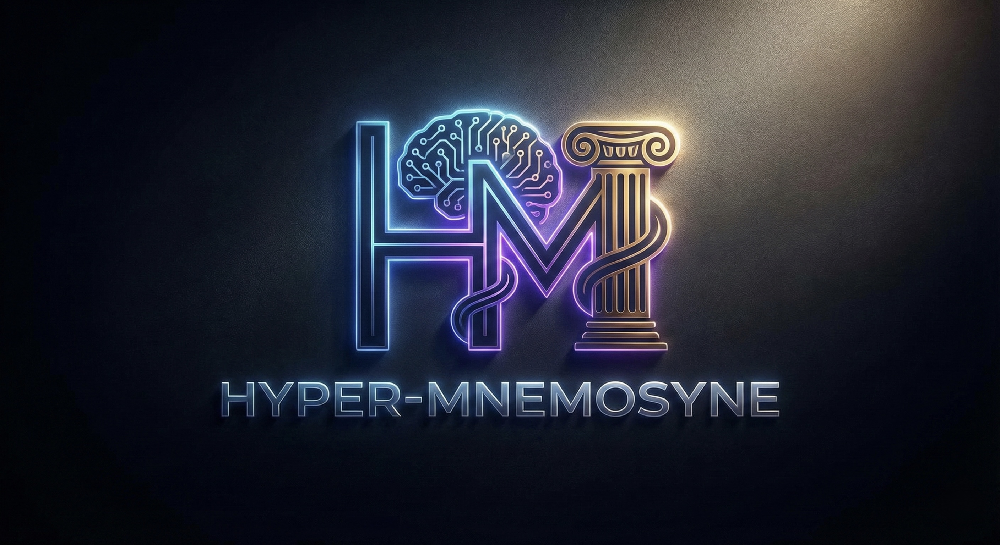

# Hyper-Mnemosyne 🧠

**Hyper-Mnemosyne** is a hybrid 3B parameter Language Model designed to run and train efficiently on consumer hardware (e.g., NVIDIA RTX 3090/4090, 24GB VRAM).

It synthesizes three cutting-edge architectures into a single "Neural Brain":

1. **Mamba-2 Backbone**: State Space Models (SSM) for efficient, linear-time context processing (replacing Transformers).
2. **Titans Neural Memory**: A long-term memory module that learns *at test time* to store user-specific facts permanently in weight space.
3. **JEPA (Joint-Embedding Predictive Architecture)**: A self-supervised objective that predicts abstract representations rather than just raw pixels/tokens, enabling higher data efficiency.

## 🚀 Quick Start

### Prerequisites

* Linux (Ubuntu 20.04/22.04 recommended)
* Python 3.10+
* NVIDIA GPU with 24GB+ VRAM (RTX 3090/4090 or A10g)
* CUDA Toolkit 11.8+

### One-Shot Training

We provide a helper script to set up the environment, download data, and start training:

```bash
# Provide permissions
chmod +x start_training.sh

# Run the all-in-one launcher
# This will setup the venv, install requirements, generate data, and start Stage 1 training.
./start_training.sh
```

### Manual Installation

```bash
# 1. Clone & Setup Entivonment
git clone https://github.com/svel26/Hyper-Mnemosyne
cd Hyper-Mnemosyne
python3 -m venv venv
source venv/bin/activate

# 2. Install Dependencies (Triton, Mamba, Torch)
pip install -r requirements.txt

# 3. Generate Data (FineWeb-Edu)
python3 scripts/prepare_fineweb.py --num_samples 20000
```

## 🧠 Architecture Overview

### The "Hybrid" Design

Standard LLMs (Llama, GPT) are just "Next Token Predictors". Hyper-Mnemosyne is a **Joint-Embedding Predictive System**.

* **Generative Head**: Predicts the next token ($L_{gen}$), allowing you to chat with it.
* **JEPA Head**: Predicts the *embedding* of the future text from the past text ($L_{jepa}$).
* **Memory Integration**: The Titans module injects "Surprise"-based memory states into the residual stream.

### Training Protocol

The model supports a **Two-Stage Training** protocol (configurable in `config.py`):

1. **Stage 1 (Backbone)**: Trains the Mamba-2 core and JEPA predictor. The Titans memory is passive.
2. **Stage 2 (Memory)**: Freezes the backbone and trains *only* the Titans neural memory module to minimize surprise.

## 🛠️ Usage

### Training

The training process is split into two stages:

#### Stage 1: Backbone Training

Trains the core Mamba-2 model and JEPA predictor.

```bash
python3 -m training.train --batch_size 1 --max_steps 5000 --training_stage backbone
```

#### Stage 2: Memory Training (Titans)

Freezes the backbone and trains the Titans Neural Memory module. Requires a pretrained Stage 1 model.

```bash
python3 -m training.train --batch_size 1 --max_steps 1000 --training_stage memory --pretrained_path model_final.pt
```

### Data Generation

Hyper-Mnemosyne uses a JEPA-masked version of FineWeb-Edu.

```bash
python3 scripts/prepare_fineweb.py --num_samples 100000 --seq_len 4096 --output_dir data/
```

### Inference

```bash
python3 inference.py --prompt "The future of AI is"
```

## 📂 Project Structure

```text
├── config.py               # Hyperparameters (Dims, Layers, JEPA weights)
├── model/
│   ├── backbone.py         # Main HyperMnemosyne Class & Hybrid Blocks
│   ├── mhc.py              # Manifold-Constrained Hyper-Connections
│   ├── titans.py           # Neural Memory Module
│   └── triton_kernels.py   # Custom CUDA/Triton Kernels (Sinkhorn)
├── training/
│   ├── train.py            # Main Loop (Two-Stage logic)
│   ├── muon.py             # Muon Optimizer (Memory Efficient)
│   └── data_utils.py       # Data Loading & JEPA Masking
├── scripts/
│   └── prepare_fineweb.py  # Production Data Pipeline
└── requirements.txt
```

## License

Apache License. See [LICENSE](LICENSE) for details.
